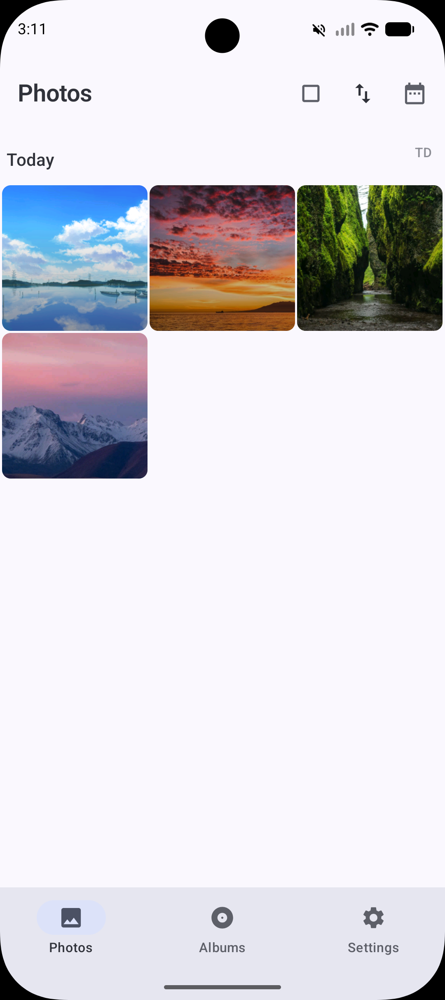
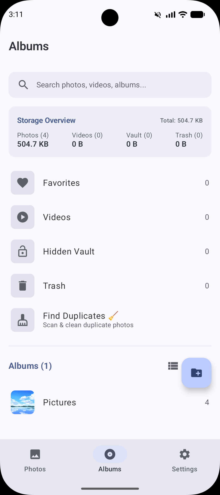
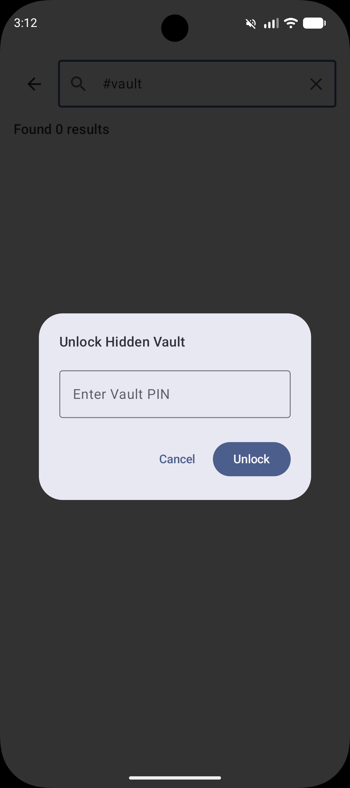
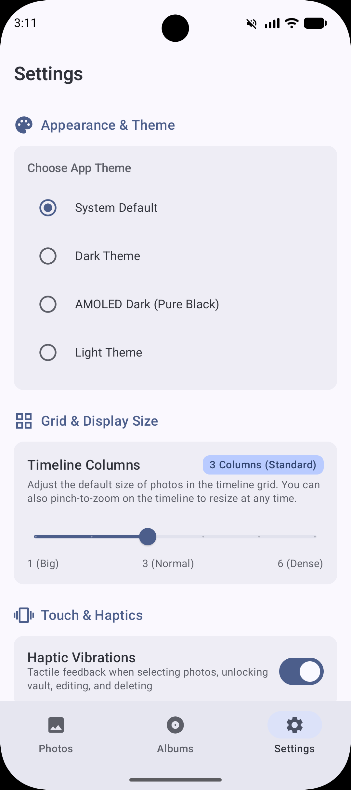

<p align="center">
  
</p>

<h1 align="center">Imava</h1>

<p align="center">
  <strong>Private by design. Your moments, yours alone.</strong>
</p>

<p align="center">
  A high-performance, privacy-focused Android Gallery application built with <strong>Jetpack Compose</strong>, <strong>Dagger Hilt</strong>, <strong>Room (KSP)</strong>, <strong>Coil</strong>, <strong>Media3 ExoPlayer</strong>, <strong>AndroidX WorkManager</strong>, <strong>AndroidX Print</strong>, and <strong>Hardware-Backed AES-256-GCM Cryptography</strong>.
</p>

---

## 📱 Screenshots & Interface

<p align="center">
  
  
  
  
</p>

---

## 🌟 Key Features & Architecture

### 🚀 Scalable Architecture & Performance
- **Jetpack Paging 3 Grid**: Incremental SQL pagination (`pageSize = 60`) loads media in small chunks with minimal UI memory footprint ($O(1)$ rendering relative to total storage).
- **Interactive Multi-Column Pinch-to-Zoom**: Pinch dynamically between 1 to 6 thumbnail columns with fluid physics, supported by a settings slider.
- **Fast Timeline Scrubber**: Equidistant date sampling with $O(1)$ cursor seeks across 100,000+ media collections.
- **Multi-URI Reactive ContentObserver**: Concurrent observation on `MediaStore.Images`, `MediaStore.Video`, and `MediaStore.Files` for immediate timeline sync when media changes externally.
- **Batched Metadata Queries**: Room queries use chunked `WHERE mediaId IN (:ids)` batch queries (500 items/chunk) to eliminate N+1 query overhead.
- **Downsampled Thumbnail Grid**: Coil `AsyncImage` decodes downsampled grid cells to `280x280` px for minimal RAM and GPU overhead.

### 📅 "On This Day" Throwback Memories (100% Offline)
- **Zero Cloud / Zero AI Memory Engine**: Automatically surfaces photos captured on today's calendar date in previous years ("1 Year Ago Today", "2 Years Ago Today") via local date queries.
- **Story Carousel Header**: Interactive, dismissible horizontal memory cards at the top of the timeline for quick access to past anniversaries and milestones.

### 🔍 Side-by-Side Photo Comparison Loupe
- **Dual-Pane Split Viewer**: Compare any two photos side-by-side with split layout switcher (vertical or horizontal split).
- **Synchronized Transform Physics**: Gestures for zooming and panning can be synchronized between both panes or adjusted independently for detail inspection.

### 🖼️ Photo Viewer, Tags & Printing
- **Interactive Swipe-Down-to-Dismiss**: Natural drag-to-dismiss gesture with dynamic scaling, positional translation, and background alpha fading back to the timeline.
- **High-Res Sub-Sampling Tile Decoder**: Memory-safe deep zoom for 50MP+ full-resolution photos without OOM.
- **🏷️ Custom Offline Tags & Hashtags**: Add custom tags (e.g. `#Receipt`, `#Travel`, `#Family`) directly from the photo details bottom sheet, indexed in Room and searchable in the search tab.
- **🖨️ Direct Hardware Printing**: Integrated `AndroidX PrintHelper` with automatic EXIF rotation to print photos directly to physical printers.
- **1-Tap "Set as Wallpaper"**: Native Android wallpaper cropper dispatch for Home & Lock screens.
- **"Set as Album Cover"**: Choose any photo to represent an album with an interactive album selector dialog.
- **EXIF GPS Resolver**: Interactive metadata bottom sheet with 1-tap "Open in Maps" navigation and date/time editor.

### 📁 Flexible Album Organization & Custom Covers
- **Multiple Layout Modes**: Switch instantly between **List View**, **Large Grid (2 Columns)**, **Medium Grid (3 Columns)**, and **Small Grid (4 Columns)**.
- **Dynamic Album Sorting**: Sort albums by **Name (A–Z)**, **Item Count (Largest first)**, or **Recently Updated**.
- **Pin & Exclude Folders**: Pin favorite albums to the top or exclude folders from indexing with one tap.
- **Storage Overview**: Live visual breakdown of total photos, videos, vault, and trash file counts and disk usage.

### 🏷️ Batch Multi-Photo Rename Tool
- **Numbered Sequence**: Rename dozens of photos at once using customizable prefixes and zero-padded counters (`Trip_###.jpg` $\rightarrow$ `Trip_001.jpg`, `Trip_002.jpg`).
- **Date-Stamped Prefix**: Prepend capture dates (`2026-08-24_<OriginalName>.jpg`).
- **Find & Replace**: Batch replace camera prefixes (e.g. replace `IMG_` with `Shoot_`).
- **Responsive Layout**: Soft-keyboard adaptive scrollable dialogs for all screen sizes and orientations.

### 🎨 Hardware-Accelerated Photo Editor & Color Tuning
- **Fine Tuning Sliders**: Adjust **Brightness** (-100 to +100), **Contrast** (0.5x to 2.0x), **Saturation** (0.0x to 2.0x), and **Warmth / Temperature** (-50 to +50).
- **1-Tap Filter Presets**: Instant GPU-rendered presets: *Original*, *B&W (Monochrome)*, *Warm Sunset*, *Cool Slate*, *Vintage Sepia*, and *Vivid Punch*.
- **Interactive Crop & Transformations**: Freeform pointer crop with explicit Apply/Reset controls, 1:1, 4:3, 16:9 aspect presets, 90° rotation, and horizontal/vertical flipping.
- **Target KB Compressor**: Memory-safe bitmap subsampling (`inSampleSize`) to compress photos to target sizes (e.g. 50 KB, 500 KB) without heap exhaustion.

### 🎥 Media3 Video Player, Speed Controls & Trimmer
- **Variable Playback Speed**: Select playback speeds from `0.25x` to `3.0x` with pitch-corrected audio, plus long-press 2x speed hold.
- **Vertical Swipe Gestures**: Left vertical drag controls screen brightness; right vertical drag controls media volume with on-screen visual feedback.
- **Multi-Audio & Subtitle Track Selector**: Switch between embedded multilingual audio tracks and subtitle/caption streams.
- **1-Tap Audio Extractor**: Lossless demuxing of video audio into `.m4a` files saved directly to `Music/Gallery_Audio` via `MediaExtractor` + `MediaMuxer` (no re-encoding delay).
- **Lossless Video Trimmer**: Keyframe-aligned track copying for instant trimming without re-encoding.
- **Animated GIF Generator**: Extracts video frames and encodes standard GIF89a animations.

### 🔐 Hardware-Backed Encrypted Vault & Decoy PIN
- **AES-256-GCM Hardware Encryption**: Media moved to the Hidden Vault is encrypted at rest using AES-256-GCM via `AndroidKeyStore` (`AES/GCM/NoPadding`, 12-byte random IV header, 128-bit authentication tag).
- **Atomic Transient Decryption Cache**: When unlocked, photos & videos are safely accessible in app-private transient cache (`VaultCacheManager`) for high-fidelity viewing with Coil & Media3 ExoPlayer, and completely wiped on vault lock (`clearVaultCache`).
- **Lossless Restore & Re-indexing**: Restoring media out of the vault decrypts byte-for-byte into public storage with original filenames, timestamps, and immediate `MediaScannerConnection` re-indexing with zero data corruption.
- **Brute-Force Resistant PIN Hashing**: PIN authentication uses `PBKDF2WithHmacSHA256` with 100,000 iterations and a 16-byte cryptographically secure salt.
- **🔒 Decoy PIN (Plausible Deniability)**: Configure an alternate decoy PIN in Vault settings that silently unlocks a fake, empty vault view when entered.
- **Persistent Lockout Rate Limiting**: Anti-tampering failed attempt tracking and lockout timestamps are persisted to prevent rate-limit bypass.
- **Dynamic `FLAG_SECURE` Protection**: Applies window security flags when viewing vault media to prevent screenshots and task preview leaks.
- **Multi-Factor Auth**: Supports PIN, 3x3 Pattern lock, and AndroidX Biometrics (Fingerprint/Face unlock).
- **Stealth Mode**: Configurable secret search trigger (e.g. `#vault`) to access the vault when the album is hidden.

### 🧹 Multi-Stage Duplicate Photo Finder
- **Fast Heuristic Filtering ($O(N)$)**: Groups candidates by identical byte size, pixel dimensions, and video duration without decoding bitmaps.
- **Burst Clustering**: Groups rapid-fire sequential captures.
- **Perceptual Hashing (`dHash` + `aHash`)**: Decodes ultra-compact $32\times 32$ 16-bit RGB_565 micro-thumbnails under a bounded concurrency Semaphore to compute Hamming distances without OOM risk.
- **Live Progress UI**: Real-time progress bar reporting items scanned.

### 🗑️ 30-Day Trash & Background Auto-Purge
- **Automatic Trash Auto-Purge**: Daily recurring background worker powered by `androidx.work:work-runtime-ktx` that permanently deletes media and database records older than 30 days.
- **One-Tap Empty Trash**: Immediate permanent purge confirmation dialog.

### 🛡️ Privacy Tools & PDF Export
- **EXIF Metadata Stripper**: Strips GPS coordinates, camera model, and private timestamps prior to sharing.
- **Multi-Photo PDF Export**: Converts selected photos into high-resolution multi-page A4 PDF documents with automatic EXIF orientation correction and landscape/portrait matching.

---

## 🛠️ Technology Stack

| Category | Technology / Library | Version | Description |
|---|---|---|---|
| **Language** | Kotlin | `1.9.22` | Core programming language |
| **Annotation Processing** | KSP (Kotlin Symbol Processing) | `1.9.22-1.0.17` | High-speed compile-time codegen |
| **UI Framework** | Jetpack Compose | `2024.02.00 BOM` | Modern declarative UI |
| **Architecture** | ViewModel + StateFlow | Android Jetpack | Reactive state management |
| **Dependency Injection** | Dagger Hilt | `2.51.1` | Compile-time dependency injection |
| **Database** | Room | `2.6.1` (KSP) | Local SQLite metadata database with exported schemas |
| **Image Loading** | Coil | `2.6.0` | In-memory stream decoding and video frames |
| **Video Player** | AndroidX Media3 (ExoPlayer) | `1.3.1` | Native video playback & progressive cipher streaming |
| **Background Tasks** | AndroidX WorkManager | `2.9.0` | Daily periodic trash auto-purge worker |
| **Pagination** | Jetpack Paging 3 | `3.2.1` | Database & MediaStore query pagination |
| **Biometrics** | AndroidX Biometric | `1.1.0` | Standardized biometric prompt API |
| **EXIF Handling** | AndroidX ExifInterface | `1.3.7` | Privacy EXIF stripping and editing |
| **Cryptography** | AndroidKeyStore (AES-256-GCM) | API 29+ | Hardware-backed vault encryption & PBKDF2 hashing |

---

## 🚀 CI/CD Automation Pipeline

The repository includes automated GitHub Actions workflows located in `.github/workflows/`:

```
Push to 'main'
   │
   ├──► [lint.yml] ────────► Code Quality & Unit Test Suite
   │
   └──► [android.yml]
          │
          ├── 1. Setup Environment (JDK 17, Gradle Cache)
          ├── 2. Extract Version from build.gradle.kts
          ├── 3. Decode Keystore & Configure Signing
          ├── 4. Run Unit Tests & Scale Benchmarks
          ├── 5. Compile & Assemble Signed Release APK (assembleRelease)
          ├── 6. Upload APK Artifact to GitHub Actions
          ├── 7. Create Git Tag (e.g. v1.1.3) & Publish GitHub Release
          └── 8. Auto-Bump Version (1.1.3 -> 1.1.4) & Commit [skip ci]
```

---

## 🧪 Testing & Verification

Run the automated test suite locally:

```bash
# Run unit tests and memory/scale benchmarks
./gradlew testDebugUnitTest

# Assemble signed release APK
./gradlew assembleRelease
```

---

## 📄 License & Attribution

Copyright (c) 2026 **HrshD1eux**

Licensed under the **GNU General Public License v2.0 (GPLv2)** with **Non-Commercial & Mandatory Attribution Clause**.

- ✅ **Allowed**: Free personal use, study, modification, compilation, and non-commercial forks.
- ❌ **Prohibited**: Commercial exploitation, selling/reselling, monetization, paid bundling, or closed-source redistribution.
- 🏷️ **Attribution**: Any public fork or redistribution must prominently credit **HrshD1eux** and link back to [https://github.com/HrshD1eux/Imava](https://github.com/HrshD1eux/Imava).

See [LICENSE](LICENSE) for full legal terms.
